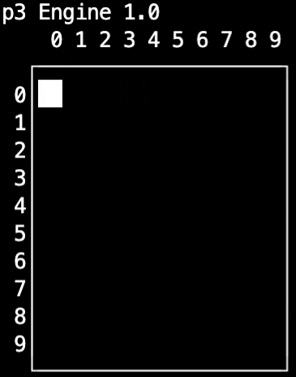
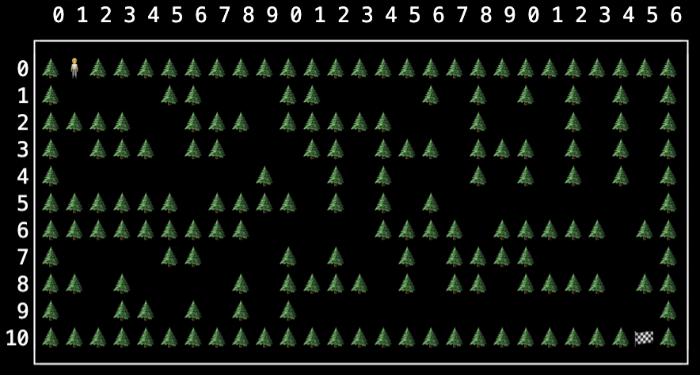
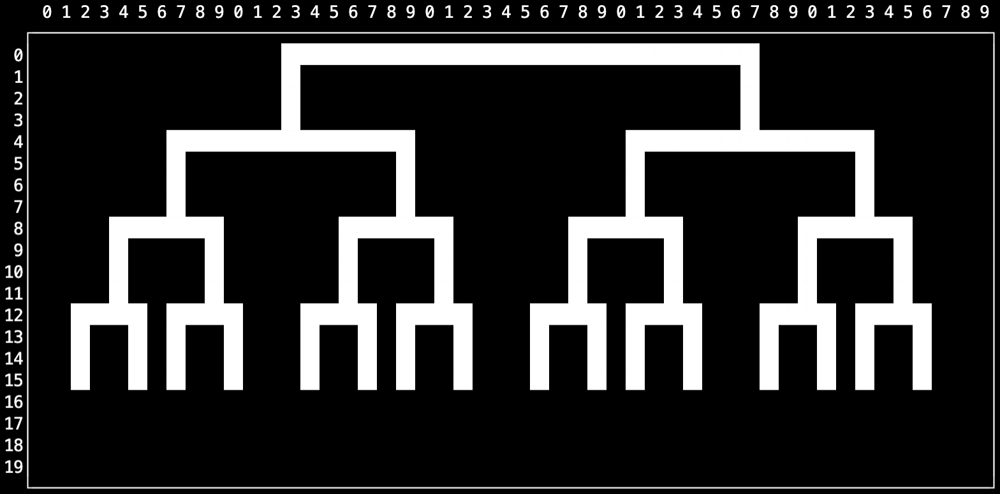

# p3 - A simple game engine for the "Project 3"

Author:

Tom Yeh\
Associate Professor\
Department of Computer Science

## Supported Environments
VSCode on coding.csel.io

(other platforms have not been tested yet)

## Quick Start
Compile and run examples:
```bash
$ g++ engine.cpp examples.cpp
$ ./a.out
```

## Hello World
```c++
#include "engine.h"
class HelloWorld : public Engine
{
    void setup()
    {
        createCanvas(10,2);
    }

    void draw()
    {
        text("Hello World", 0, 0);
    }
};

int main()
{
    HelloWorld game;
    game.play();
    return 0;
}
```

```
p3 Engine 1.0
    0 1 2 3 4 5 6 7 8 9
  ┌────────────────────┐
 0│Hello World         │
 1│                    │
  └────────────────────┘
```

# Basic Examples

## Point
```c++
class PointExampleReadme : public Engine
{
    void setup()
    {
        createCanvas(10,10);
    }

    void draw()
    {
        point(1, 1);

        stroke("->");
        point(3, 3);
    }
};
```

```
    0 1 2 3 4 5 6 7 8 9
  ┌────────────────────┐
 0│                    │
 1│  ██                │
 2│                    │
 3│      ->            │
 4│                    │
 5│                    │
 6│                    │
 7│                    │
 8│                    │
 9│                    │
  └────────────────────┘
```

## Animation

```c++
class Game : public Engine
{
    int x = 0;    
    void setup()
    {
        createCanvas(10,10);
    }

    void draw()
    {
        clear();
        point(x, 0);        
        if (x == 10)
        {
            x = 0;
        }
        else
        {
            x++;
        }
    }
};

int main()
{
    Game game;
    game.play();
}
```



## Keyboard

This game allows a user to move a point around the canvas by pressing keys.

```c++
class KeyPressedExample : public Engine
{
    int x;    
    int y;
    void setup()
    {
        x = 0;     
        y = 0; 
        createCanvas(10, 10);
    }

    void draw()
    {
        clear();
        point(x, y);        
    }

    void keyPressed(int keyCode)
    {
        switch (keyCode)
        {
            case 'd':        
                x = x + 1;
                break;

            case 'a':
                x = x - 1;
                break;

            case 'w':
                y = y - 1;
                break;

            case 's':
                y = y + 1;
                break;
        }
    }
};
```

# Advanced Examples

## Maze
Souce code: [maze-game.cpp](maze-game.cpp)

Compile and run
```
$ g++ engine.cpp maze-game.cpp
$ ./a.out
```



## Recursive Tree
```c++
class RecursiveTrees : public Engine
{
    void setup()
    {
        createCanvas(50, 20);
        redraw();
        noLoop();
    }

    void branch(int x, int y, int size)
    {     
        if (size > 2)
        {            
            int x1 = x - size * 0.4;
            int x2 = x + size * 0.4;
            horizontal_line(y, x1, x2);
            vertical_line(x1, y+1, y+3);            
            vertical_line(x2, y+1, y+3);            

            branch(x1, y+4, size/2);
            branch(x2, y+4, size/2);
        }        
    }

    void draw()
    {        
        branch(25, 0, 30);
    }

};
```



## Fibonacci
```c++
class Fibonacci : public Engine
{
    void setup()
    {
        createCanvas(35, 10);

        fv(6,20,0);
        redraw();
        noLoop();
    }

    int fv(int n, int x, int y)
    {
        if (n == 1 || n == 0)
        {
            text("f(" + to_string(n) + ")=1", x, y);            
            return n;
        }
        else
        {
            stroke("──");
            horizontal_line(y+1, x - 4, x + 4);
            stroke("─┴");
            point(x, y+1);

            int v =  fv(n - 1, x - 4, y + 1) + fv(n - 2, x + 4, y + 1);
            
            text("f(" + to_string(n) + ")=" + to_string(v), x, y);
            
            return v;
        }
    }

};
```
```bash
    0 1 2 3 4 5 6 7 8 9 0 1 2 3 4 5 6 7 8 9 0 1 2 3 4 5 6 7 8 9 0 1 2 3 4
  ┌──────────────────────────────────────────────────────────────────────┐
 0│                                        f(6)=8                        │
 1│                                f(5)=5───┴──────f(4)=3                │
 2│                        f(4)=3───┴──────f(3)=2───┴──────f(2)=1        │
 3│                f(3)=2───┴──────f(2)=1───┴──────f(1)=1───┴──────f(0)=1│
 4│        f(2)=1───┴──────f(1)=1───┴──────f(0)=1                        │
 5│f(1)=1───┴──────f(0)=1                                                │
 6│                                                                      │
 7│                                                                      │
 8│                                                                      │
 9│                                                                      │
  └──────────────────────────────────────────────────────────────────────┘
```