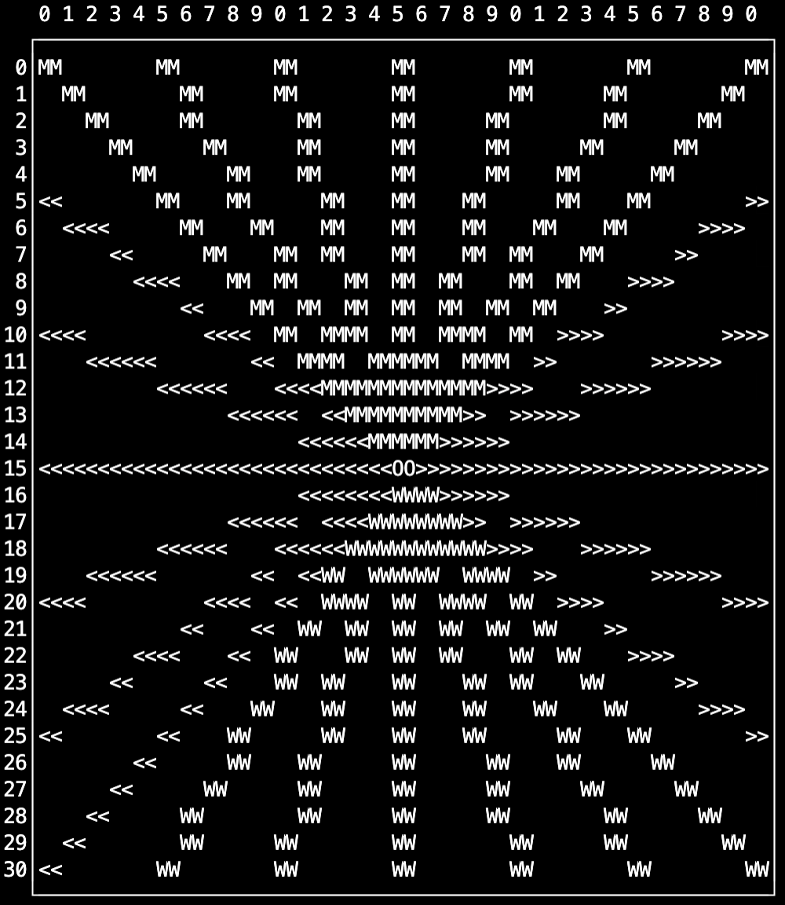

# p3 - A simple game engine


__Author:__

Tom Yeh\
Associate Professor\
Department of Computer Science

## Motivation

* Support stduents in CSCI 1300 to build interactive games for the "Project 3"
* Provide drawing and animation features similar to that of [p5.js](https://p5js.org/) that are achievable in a terminal environment. 
* Enable students who want to go above and beyond with their games.

## Supported Environments
VSCode on [coding.csel.io](https://coding.csel.io/)

(other platforms have not been tested yet)

## Quick Start
Compile and run examples:
```bash
$ g++ engine.cpp examples.cpp
$ ./a.out
```

## Hello World


```c++
#include "engine.h"
class HelloWorld : public Engine
{
    void setup()
    {
        createCanvas(10,2);
    }

    void draw()
    {
        text("Hello World", 0, 0);
    }
};

int main()
{
    HelloWorld game;
    game.play();
    return 0;
}
```


# Basic Examples

## Point


```c++
class Points : public Engine
{
    void setup()
    {
        createCanvas(10,10);
    }

    void draw()
    {
        point(1, 1);
        point(3, 3);
        point(5, 5);
        point(7, 7);        

        describe("Four points.");
    }
};
```


## Vertical/Horizontal Lines


```c++
class VerticalHorizontalLines : public Engine
{
    void setup()
    {
        createCanvas(10,10);
    }

    void draw()
    {
        vertical_line(1, 2, 9);
        vertical_line(3, 2, 9);
        vertical_line(5, 2, 9);

        horizontal_line(3, 0, 7);
        horizontal_line(5, 0, 7);
        horizontal_line(7, 0, 7);

        describe("Three vertical lines and three horizontal lines.");
    }
};
```

## Line


```c++
class Diagonals : public Engine
{
    void setup()
    {
        createCanvas(10,10);
    }

    void draw()
    {
        line(0,0,9,9);
        line(9,0,0,9);
    }
};
```



```c++
class Rays : public Engine
{
    void setup()
    {
        createCanvas(31,31);
    }

    void draw()
    {
        for (int i = 0 ; i <= 30; i = i + 5)
        {
            stroke("<<");
            line(0, i, 15, 15);            
            stroke(">>");
            line(30, i, 15, 15);
            stroke("MM");
            line(i, 0, 15, 15);
            stroke("WW");
            line(i, 30, 15, 15);
        }
        stroke("OO");
        point(15,15);
    }
};
```

## Rect


```c++
class RectExample : public Engine
{
    void setup()
    {
        createCanvas(20,10);
    }

    void draw()
    {
        rect(0, 0, 4, 4);

        rect(7, 3, 4, 4);
        
        rect(15, 2, 5, 5);

        describe("Three rectangules.");
    }
};

```
## Stroke


* A stroke symbol is a two character string, such as `"->"`.
* A stroke symbol can be a unicode graphical symbol. Some are already two character wide, such as `"🌲"`. You can use a search engine like the [Unicode Table](https://unicode-table.com/en/) to find a symbol you want and copy/paste it into your code. Some are single character and you need to include two, such as `"★★"`.

```c++
class StrokeExample : public Engine
{
    void setup()
    {
        createCanvas(10, 10);
    }

    void draw()
    {
        clear();

        stroke("->");
        point(1, 1);         
        horizontal_line(5, 2, 8);

        stroke("🌲");
        point(1, 2); 
        horizontal_line(6, 2, 8);

        stroke("★★");
        point(1, 3); 
        horizontal_line(7, 2, 8);        
    }
};
```

## Background


```c++
class BackgroundExample : public Engine
{
    void draw()
    {
        background("xx");        
        point(3, 3);
        point(5, 5);
        describe("Two points against a background filled by x's.");
    }
};

```

# Color Examples

## point and text in colors


```c++
class PrimaryColors : public Engine
{ 
    void setup()
    {
        createCanvas(10,10);
    }

    void draw()
    {        
        Color red(255,0,0);        
        stroke(red);
        point(1,1);
        text("red", 1, 2);

        Color green(0,255,0);
        stroke(green);
        point(1,3);
        text("green", 1, 4);
        
        Color blue(0,0,255);
        stroke(blue);
        point(1,5);
        text("blue", 1, 6);
    }
};
```

## rects in colors

```c++
class ColorRects : public Engine
{ 
    void setup()
    {
        createCanvas(16,8);
    }

    void draw()
    {
        Color yellow(255,255,0);
        Color red(255,0,0);
        Color green(0,255,0);

        stroke(red);
        rect(0,0,4,4);        

        fill(yellow);
        rect(5,0,4,4);

        stroke(green);
        fill(green);
        rect(10,0,4,4);
    }
};
```


## Gradients


```c++
class Gradients : public Engine
{ 
    void setup()
    {
        createCanvas(20,7);     
    }

    void draw()
    {
        int s = 0;
        for (int i = 0; i < 20; i++)
        {
            s = s + 10;
            Color c(s, 0, 0);
            stroke(Color(s,0,0));
            point(i,1);
            stroke(Color(0,s,0));
            point(i,3);
            stroke(Color(0,0,s));
            point(i,5);
        }
        
    }
};
```
# Animation Examples

## Example: Changing Location


```c++
class PointAnimation : public Engine
{
    int x = 0;    
    void setup()
    {
        createCanvas(10,10);
    }

    void draw()
    {
        clear();
        point(x, 0);        
        if (x == 10)
        {
            x = 0;
        }
        else
        {
            x++;
        }

        describe("A point moving horizontally across the canvas.")
    }
};
```

## Example: Changing Size


```c++
class RectAnimation : public Engine
{
    int s;
    int ds;
    
    void setup()
    {
        s = 0;    
        ds = 1;
        createCanvas(10, 10);        
    }

    void draw()
    {
        clear();
        rect(0,0,s,s);
        // if the size reaches the max
        if (s == 10)
        {
            // decrease
            ds = -1;
        }
        // else if the size reaches the min
        else if (s == 0)
        {
            // increase
            ds = 1;
        }
        // update the rectangle's size
        s = s + ds;

        describe("A box is expanding and then shrinking in size.");
    }
};
```

## Example: Scrolling Text


```c++
class ScrollingTextExample : public Engine
{
    string message = "This is a really long message to display.";

    // offset in the x direction to implement the scrolling effect
    int offset = 0;

    void setup()
    {
        createCanvas(10, 2);
    }

    void draw()
    {
        // join two copies of the same message so that we can
        // have the tail of the message followed immeidately by
        // the head of the same message.
        string message2 = message + " " + message;

        // extract a substring that can fit inside the canvas        
        // because each x,y can display 2 characters, the 
        // toal number of characters we can fit is
        // 2 x getWidth();
        string fit = message2.substr(offset, 2 * getWidth());
        
        clear();
        text(fit, 0, 0);
        offset++;

        // wrap around if offset exceeds the size of the message
        // which can be achieved by taking the modulo of n where
        // n is the size of the message
        int n = message.size();
        offset = offset % message.size();
    }

};
```

## Example: Random Fill


```c++
class RandomFill : public Engine
{
    // 2d array to keep track of whether a location is filled
    // 0: unfilled, 1: filled
    int filled[8][8] = {0};
    void setup()
    {
        createCanvas(8, 8);        
    }

    void draw()
    {
        int x;
        int y;

        // randomly draw a location (x,y) that has not
        // already been filled
        do
        {
            x = random(8);
            y = random(8);
        } while (filled[y][x] == 1);
        
        // draw a point at an unfilled location
        point(x,y);

        // mark the location as filled
        filled[y][x] = 1;
        
        describe("The screen is gradually filled up.");
    }
};
```

## Example: Scanning Line


```c++
class ScanningLine : public Engine
{

    int y = 0;
    int dy = 1;
    void setup()
    {
        createCanvas(20,20);     
    }

    void draw()
    {
        clear();
        line(0,0,20,y);
        if (y == 20)
        {
            dy = -1;
        }
        else if (y == 0)
        {
            dy = 1;
        }
        y = y + dy;
    }
};
```

# User Input

## Keyboard

This example demonstrates how to handle keyboard events (i.e., when a user pressed a key) and updates the location of a point on the canvas.

```c++
class KeyPressedExample : public Engine
{
    int x;    
    int y;
    void setup()
    {
        x = 0;     
        y = 0; 
        createCanvas(10, 10);
    }

    void draw()
    {
        clear();
        point(x, y);        
    }

    void keyPressed(int keyCode)
    {
        switch (keyCode)
        {
            case 'd':        
                x = x + 1;
                break;

            case 'a':
                x = x - 1;
                break;

            case 'w':
                y = y - 1;
                break;

            case 's':
                y = y + 1;
                break;
        }
    }
};
```

## Menu

This example demonstrates how to enable the user to press a key to open up a simple menu.


```c++
class MenuExample : public Engine
{
    bool isMenuOpen = false;

    void setup()
    {
        createCanvas(10,1);
    }

    void keyPressed(int keyCode)
    {
        switch (keyCode)
        {
            case 'x':
            case 'X':
                isMenuOpen = true;
                break;
        }
    }

    void console()
    {
        if (!isMenuOpen)
        {
            cout << "Press [X] to open the menu" << endl;
        }
        else
        {
            cout << "MENU" << endl;
            cout << "1. Open" << endl;
            cout << "2. Save" << endl;
            cout << "3. Quit" << endl;
            cout << "Choose one:";
            string choice;
            cin >> choice;
            if (choice == "1")
            {
                cout << "Opening the file" << endl;
                pause();
            }
            else if (choice == "2")
            {
                cout << "Saving the file" << endl;
                pause();
            }
            else if (choice == "3")
            {
                cout << "Quitting" << endl;
                cout << "Bye!" << endl;
                quit();
            }
            else
            {
                cout << "The option is invalid" << endl;
                pause();
            }
            isMenuOpen = false;
        }
    }

};
```

# Game Examples

## Chore Game
In this game, the player needs to visit two locations, a school and a bank, in order to complete two chores. Once both chores are completed, the player won the game. This example demonstrates how to check if the player arrives at a location, how to use `cin` and `cout` to implement an interactive dialog for the player to do the chore at that location, and how to use  use `boolean` variables as flags to keep track of the player's progress (i.e., whether or not the player has completed each mission).


Source code: [chore-game.cpp](chore-game.cpp)

Compile and run:
```
$ g++ engine.cpp chore-game.cpp
$ ./a.out
```

## Dog Game
In this game, the player is first prompted to choose the number of dogs to place on a map. Then, the player moves around the map toward the goal, trying not to run into any of the dogs roaming around. This example demonstrates how tp represent each dog as an object instance of the `Dog` class, how to handle collisons (i.e., the player is in the same location as one of the dogs) and how to trigger events (i.e., the player was bitten by a dog and lost).


Source code: [dog-game.cpp](dog-game.cpp)

Compile and run:
```bash
$ g++ engine.cpp dog-game.cpp 
$ ./a.out
```

## Chance Game
In this game, the player moves a vehicle around the map.
Each time the vehicle moves, there is a 1 in 10 chance the player
got pulled over by the police, and a 2 in 10 chance the player
ran over a pothole. This example demonstrates how you can 
trigger chance events in a game.


Source code: [chance-game.cpp](chance-game.cpp)

Complie and run:
```
$ g++ engine.cpp chance-game.cpp
$ ./a.out
```
## Maze Game
In this game, the player moves aroud in a maze to reach the goal. This game demonstrates how to read map data from a file and populate an internal 2D data structure, and draw individual map tiles (e.g., player, wall, empty space, goal, breadcrumb).


Souce code: [maze-game.cpp](maze-game.cpp)

Compile and run
```
$ g++ engine.cpp maze-game.cpp
$ ./a.out
```

## Room Game
In this game, the player explores different rooms to collect treasures and avoid monsters. This game demonstrates how to scroll a map that's larger than the screen, while centering on the player. It also demonstrates how to load a game map and draw individual tiles.


Souce code: [room-game.cpp](room-game.cpp)

Compile and run
```
$ g++ engine.cpp room-game.cpp
$ ./a.out
```

## Run Game
In this game, the player is running on a course  with obstacles and treasures. This game demonstrates how to generate a random game map filled with obstacles and treasures, and how to use `translate` to achieve the effect of scrolling the map vertically.


Souce code: [run-game.cpp](run-game.cpp)

Compile and run
```
$ g++ engine.cpp run-game.cpp
$ ./a.out
```

## Hacker Quest

In this game, the player takes on the role of a hacker who navigates a cyberspace to visit server rooms and hack the servers inside. It demonstrates how to use `MapGame` to implement several key game mechanics required by the Project 3, as follows. 

1. __Start__: The player is shown the title of the game, prompted for a question, and greeted with a welcome message.

    

2. __Menu__: The player presses `M` to bring up a different menu for each type of location (i.e., room vs non-room)

    

3. __Random Events__: As the player moves around the map, random events happen.

    

The implementation of the game uses the `MapGame` class. The `MapGame` class is a subclass of the `Map` class provided to you for the Project3. As such, it is almost identical to the `Map` class except that it uses the p3 game engine to draw the map and handle keyboard events. Moreover, the `MapGame` class is also a subclass of the `Engine` class. As such, it gives you all the interactive features to provide a better playing experience. If you plan to use the p3 engine for your Project 3, you can use `MapGame` as a substitute for `Map`. 

Souce code: 
* [hacker-game.cpp](hacker-game.cpp)
* [MapGame.h](MapGame.h)
* [MapGame.cpp](MapGame.cpp)

Compile and run
```
$ g++ engine.cpp MapGame.cpp hacker-game.cpp
$ ./a.out
```

# Advanced Examples

## Recursive Tree


```c++
class RecursiveTrees : public Engine
{
    void setup()
    {
        createCanvas(50, 20);
        branch(25, 0, 30);
    }

    void branch(int x, int y, int size)
    {     
        if (size > 2)
        {            
            int x1 = x - size * 0.4;
            int x2 = x + size * 0.4;
            horizontal_line(y, x1, x2);
            vertical_line(x1, y+1, y+3);            
            vertical_line(x2, y+1, y+3);        

            redraw();
            sleep(300);    

            branch(x1, y+4, size/2);
            branch(x2, y+4, size/2);
        }        
    }
};
```

## Fibonacci

```c++
class Fibonacci : public Engine
{
    void setup()
    {
        createCanvas(35, 10);
        fv(6,20,0);
    }

    int fv(int n, int x, int y)
    {
        if (n == 1 || n == 0)
        {
            text("f(" + to_string(n) + ")=1", x, y);
            redraw();
            sleep(300);                        
            return n;
        }
        else
        {
            stroke("──");
            horizontal_line(y+1, x - 4, x + 4);
            stroke("─┴");
            point(x, y+1);

            int v =  fv(n - 1, x - 4, y + 1) + fv(n - 2, x + 4, y + 1);
            
            text("f(" + to_string(n) + ")=" + to_string(v), x, y);
            redraw();
            sleep(300);
            return v;
        }
    }

};
```